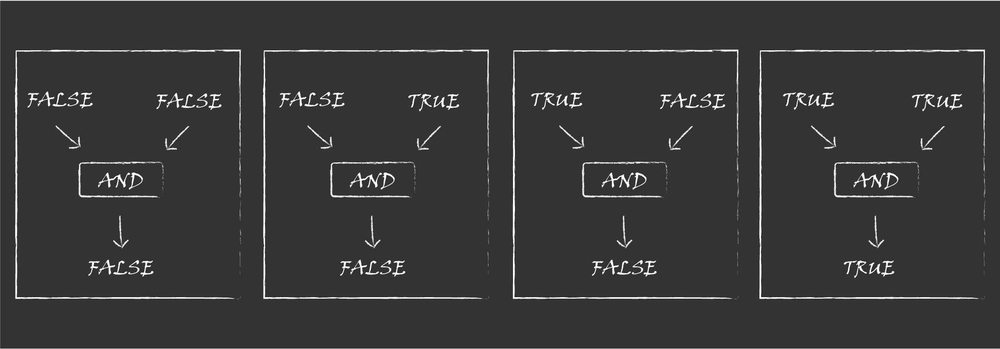

# Computer Circuits

zkSNARKs are systems for creating proofs or justifications that a computation was done correctly. These computations are expressed as circuits, and we want to make clear what is meant by a circuit here. To do that, let’s first review the concept of circuits in computers.

The basic logic of computer circuits is something called <mark style="color:purple;">**Boolean algebra**</mark>. In this system of mathematics, there are two types of values: TRUE or FALSE. These values are normally represented as 1 or 0 and are the only inputs and outputs needed for a computer circuit to function. The values 1 & 0 or TRUE & FALSE are referred to as boolean values after George Bool who was one of the first people to work with them.

Boolean algebra has three basic types of operations: AND, OR, NOT. These operations are also called logic gates or gates for short – they take in 1 or 2 boolean values and output a single boolean value.&#x20;

Here is an example AND gate, with all 4 possible ways of filling it out. The output of an AND gate is TRUE if and only if both inputs are TRUE.&#x20;

<figure><figcaption>
All possible, valid AND gate configurations
</figcaption></figure>

We refer to the output of a gate on all its possible inputs as a truth table, here is the truth table for our example AND gate.

<figure><figcaption>
AND gate's truth table, using 0s and 1s in place of FALSE and TRUE
</figcaption></figure>

Instead of sketching filled out AND gates, we can instead put variable wire values, meaning that the inputs are undecided.

<figure><figcaption>
A generic AND gate with variable wire values
</figcaption></figure>

In this sketch, x represents input1, y represents input2, and z represents the output. When we sketch out circuits later we are usually going to assume that the wire values are variable.

When we put lots of gates together, we get something we call a circuit. By putting gates together in the right ways, we can do more advanced things, like adding or multiplying large numbers. It is billions of gates like these, interconnected and stacked on top of each other, that allow a computer to use the internet and read this text.&#x20;

An important thing to highlight here is that these gates and wires are physical manifestations of the mathematical constraints. Each physical gate in a computer runs an electrical current that represents these operations with wires transmitting the values. What we are actually interested in are the constraints themselves; the gates and wires are just a very useful perspective to think about them from (and computers are examples of how we can use these constraints to do useful things).

What is a circuit?

A circuit is a list of constraints that must be satisfied; this is best understood by imagining constraints as gates and connecting them with wires

