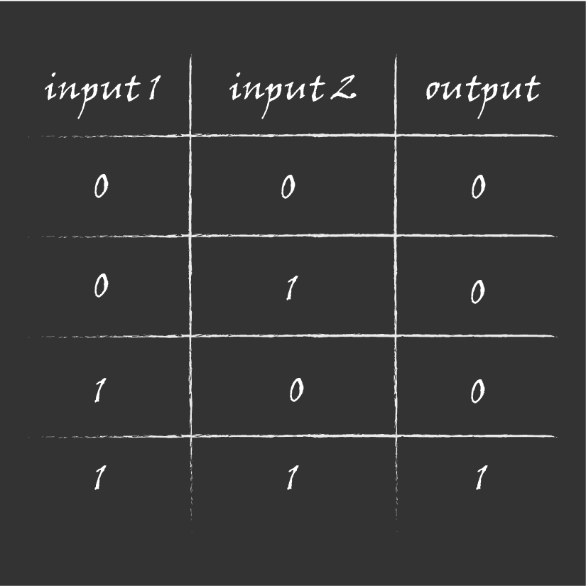

# Argument of Knowledge

In exploring new areas, the first task is usually figuring out what the definitions are. This is especially true in mathematics. And this is partly why a field like zero-knowledge proofs can seem so confusing and overwhelming. Settling on definitions takes time and effort, but in a space where new discoveries are a relatively common occurrence, most experts are focused on what is next instead of trying to explain what has already happened, especially in common language.

In the following sections, we will outline a few simple ideas so that we can build upon them to arrive at a far more complex and more powerful tool: zero-knowledge proofs.

## Mathematical guarantees

Math can be thought of as a complex logical game where the basic rule is consistency. Contradictions are not allowed, which means one statement and its opposite cannot both be true in the same context. With consistency and some basic assumptions called <mark style="color:purple;">**axioms**</mark>, we can derive new truths and objects in the form of <mark style="color:purple;">**theorems**</mark> via proofs. By playing around with definitions or moving different objects around in new ways, new mathematical areas and tools can appear - these allow us to build things that were not possible before as beautifully demonstrated by this video here:



<mark style="color:purple;">**Proof systems**</mark> will give us mathematical proofs that say something like “with 99.9999999999999999% likelihood, the following statement is true: Alice owns more than 1 ETH.” But the value of this mathematical proof is in its relation to the real world.

A ZK proof could also tell us that:

- Alice is over a certain age
- Alice can vote in a certain jurisdiction
- Alice has no criminal record

The percentage likelihood means <mark style="color:purple;">**ZK proofs**</mark> are probabilistic. They are not true with absolute certainty, but the chances of them being wrong or broken are practically zero.

As an analogy, we often work in realms where there are 2^256 values, which is about 10^77 (10 with 77 zeroes after it). That’s roughly the number of particles in the entire observable universe, and we quite simply will never have traditional computers that can search a space this large to find a hidden value. And that’s the basis of a lot of our security. You can check out a more beautifully presented example of this size in this video here:



The logical consistency of the mathematical system in which ZK proofs are created, combined with the probability of the assumptions that underlie that system give us a remarkable degree of certainty in the truth of the proof. In other words, proofs can be trusted because of strong logic and very high probabilities.

These assumptions are based purely on mathematical ideas, and mathematical proofs make those ideas inherently true, so there is less room for discussion of whether a belief is justified. Because the assumptions are considered secure or very unlikely to be broken, then the proofs that are derived from the assumptions also inherit the property of being secure or hard to break.

With ZK proofs, we will take their claims and say “since the probability is so high, we can assume that, for all intents and purposes, Alice really does have 1 ETH, really is over a certain age, or really can vote.”

As we delve deeper we will see in more detail what kinds of statements we will be making proofs for, and why these statements hold value. But first, let's cut to the chase and give you the core idea of what zkSNARKs are.

What sort of claim does a zk proof make?

"With 99.99...% likelihood, the following claim is true: Alice has >1 Eth"

## Verifiable computation

<mark style="color:purple;">**zkSNARKs**</mark> are an example of <mark style="color:purple;">**Verifiable Computation**</mark> (VC), which means a system where computational work is checked to see if it was done correctly. The proof that is created is evidence that the computation was done correctly.

Of course there is a naive way to check any computation with 100% probability, and that is to simply redo the computation yourself and see if you get the same result. But it turns out that you can check the validity of a result without redoing the computation.

And it turns out we can go a step further, and check the validity of a computation without knowing all the data that was used for it. For example, if you (the <mark style="color:purple;">**verifier**</mark>) give your friend (the <mark style="color:purple;">**prover**</mark>) a Rubik’s cube and they solve it, when they show you the solved Rubik’s cube you will be convinced that they indeed did solve the computation, but you have not learned the solution of how to solve a Rubik’s cube. Your friend, the prover, has shown that they know an answer without revealing any other information. The proof is zero-knowledge and preserves privacy.

zkSNARKs also turn out to have another very valuable property: the process of verifying the computation is far quicker than redoing the computation. We call this succinctness or scalability.

There is a lot more detail we need to add to understand this better, but this is a good catalyst to grow your understanding around. The rest of this course is aimed at adding memorable chunks of detail to this basic idea.

What is VC?

VC is a process where the outcome of a computation can be verified; of course this is only interesting when the verification does not involve redoing the computation

## Computer Circuits

zkSNARKs are systems for creating proofs or justifications that a computation was done correctly. These computations are expressed as circuits, and we want to make clear what is meant by a circuit here. To do that, let’s first review the concept of circuits in computers.

The basic logic of computer circuits is something called <mark style="color:purple;">**Boolean algebra**</mark>. In this system of mathematics, there are two types of values: TRUE or FALSE. These values are normally represented as 1 or 0 and are the only inputs and outputs needed for a computer circuit to function. The values 1 & 0 or TRUE & FALSE are referred to as boolean values after George Bool who was one of the first people to work with them.

Boolean algebra has three basic types of operations: AND, OR, NOT. These operations are also called logic gates or gates for short – they take in 1 or 2 boolean values and output a single boolean value.

Here is an example AND gate, with all 4 possible ways of filling it out. The output of an AND gate is TRUE if and only if both inputs are TRUE.

<figure><figcaption>
All possible, valid AND gate configurations
</figcaption></figure>

We refer to the output of a gate on all its possible inputs as a truth table, here is the truth table for our example AND gate.

<figure><figcaption>
AND gate's truth table, using 0s and 1s in place of FALSE and TRUE
</figcaption></figure>

Instead of sketching filled out AND gates, we can instead put variable wire values, meaning that the inputs are undecided.

<figure><figcaption>
A generic AND gate with variable wire values
</figcaption></figure>

In this sketch, x represents input1, y represents input2, and z represents the output. When we sketch out circuits later we are usually going to assume that the wire values are variable.

When we put lots of gates together, we get something we call a circuit. By putting gates together in the right ways, we can do more advanced things, like adding or multiplying large numbers. It is billions of gates like these, interconnected and stacked on top of each other, that allow a computer to use the internet and read this text.

An important thing to highlight here is that these gates and wires are physical manifestations of the mathematical constraints. Each physical gate in a computer runs an electrical current that represents these operations with wires transmitting the values. What we are actually interested in are the constraints themselves; the gates and wires are just a very useful perspective to think about them from (and computers are examples of how we can use these constraints to do useful things).

What is a circuit?

A circuit is a list of constraints that must be satisfied; this is best understood by imagining constraints as gates and connecting them with wires

## ZK-Circuits

A <mark style="color:purple;">**zk-circuit**</mark> is a collection of constraints where allowed values and operations are clearly defined. In general we will simply call them circuits because there are no other circuits to confuse the zk-circuits with.

Boolean algebra creates the basic logic of computer circuits. But what if rather than the numbers 0 and 1 as in boolean algebra, we use numbers between 0 and 10, and instead of boolean gates, we use addition or multiplication? The change in definitions for values and operations allows us to create the zero-knowledge circuits used in zero-knowledge proofs.

Creating ZK circuits by laying out arithmetic gates like addition and multiplication is called <mark style="color:purple;">**arithmetization**</mark>.

In a ZK circuit, some values will be determined by constraints, and some will be variable. For example, if we have the constraint: $$a*b=c$$, then $$c$$ has to be the value we get when we multiply $$a$$ by $$b$$.

<figure><figcaption>
A single constraint written as simple math and also drawn as a gate
</figcaption></figure>

The image above gives you two perspectives on the gate. The first is like the boolean gates we drew earlier that were visually nice, and the second is the same constraint but written more mathematically. We show you both interpretations because some proof systems use constraints that can’t be drawn in a visually pretty way like this multiplication gate.

What values do a and b take? There are 2 possibilities – either they are variable values where we can place any number when filling out the circuit, or they are predetermined and the circuit specifies the value.

In this example, if a is variable and b is predetermined to be 23, then c must be 23 times whatever value a is chosen to be.

<figure><figcaption>
The same constraint as above, but here b is specified to be 23
</figcaption></figure>

When we fill out a circuit, what we are doing is plugging in values for all the variable values that the circuit had, as well as determining any downstream values.

In the example above we said that $$a$$ was variable, so when we fill out the circuit we will set a value for it, let’s say 3. Then we need to determine the downstream values, which in this case is c. The predetermined value for b is 23, so c then must be 69.

In the example above we said that a was variable, so when we fill out the circuit we will set a value for it, let’s say 3. Then we need to determine the downstream values, which in this case is c. The predetermined value for b is 23, so c then must be 69.

<figure><figcaption>
A filled out or satisfied instance of the above 2 constraints (either every value was variable, or b was set to 23)
</figcaption></figure>

We refer to the collection of all values that aren’t predetermined by the circuit as the <mark style="color:purple;">**witness**</mark>. A witness is considered to be valid or invalid depending on whether it can fill out the circuit correctly.

In the above example, c would be a part of the witness, whereas b wouldn’t because it was already specified by the circuit.

<figure><figcaption>
2 examples of a constraint (left) with a valid witness (right)
</figcaption></figure>

The above circuits each with a valid witness because the math checks out. In the first circuit b is a part of the witness because it is not specified by the circuit.

As you may have noticed, even in our simple circuit example, there are many possible witness values that you could plug in to make the circuit work. This is why circuits can be reused. Once the order of operations and constraints have been defined, the witness can be changed to serve different purposes.

And, of course, this being zero-knowledge proofs, witness values can be kept secret.

SNARKs are really a tool for making proofs about circuits having a valid witness. If a prover is able to provide a valid witness, they are on their way to making a credible and verifiable claim without revealing the actual data or inputs used.

From these simple relationships and some other basic tools, which we will discuss throughout this series, we can start building arguments of knowledge or justifications for why something is true (why your witness satisfies the circuit).

What is a ZK-Circuit?

Like a normal computer circuit, it is a collection of constraints - best imagined as a series of gates connected with wires

What does a ZK-proof actually claim?

"With 99.99...% likelihood, the prover knows a witness that satisfies the constraints of a circuit"

## Recap

<mark style="color:purple;">**zkSNARKs**</mark> are a type of <mark style="color:purple;">**verifiable computation**</mark> where a <mark style="color:purple;">**verifier**</mark> can check if a computation was done correctly. A <mark style="color:purple;">**proof system**</mark> is a specific method for a <mark style="color:purple;">**prover**</mark> to create a <mark style="color:purple;">**ZK proof**</mark> showing a <mark style="color:purple;">**circuit**</mark> was filled in correctly with a valid <mark style="color:purple;">**witness**</mark>. <mark style="color:purple;">**ZK circuits**</mark> are created via <mark style="color:purple;">**arithmetization**</mark> while computer circuits are created using <mark style="color:purple;">**Boolean algebra**</mark>. Both types of circuits are useful and both are consistent mathematical systems built on founding <mark style="color:purple;">**axioms**</mark> and derived <mark style="color:purple;">**theorems**</mark>**.**

### Terms

<mark style="color:purple;">**Axiom**</mark>: Founding assumptions

<mark style="color:purple;">**Theorem**</mark>: Truths derived from axioms and definitions

<mark style="color:purple;">**Proof system**</mark>: Mathematically consistent systems for creating valid claims or arguments of knowledge

<mark style="color:purple;">**zkSNARK**</mark>: System that allows us to make justifications (in the form of ZK proofs) about the truthfulness of a computation, selectively revealing wire values

<mark style="color:purple;">**ZK proof**</mark> A piece of data that claims a circuit has been filled out correctly

<mark style="color:purple;">**Verifiable computation**</mark>: A system that allows claims to be made about some computation having been done correctly

<mark style="color:purple;">**Verifier**</mark>: Decides whether a proof is satisfactory enough to justify its claims.

<mark style="color:purple;">**Prover**</mark>: Generator of a proof

<mark style="color:purple;">**Boolean algebra**</mark>**:** System of mathematics used to create computers circuits; the values are TRUE or FALSE; the operators are AND, OR, NOT

<mark style="color:purple;">**Arithmetization**</mark>: System of mathematics used to create ZK circuits; the values are numbers in a predetermined set (finite field); the operators are addition and multiplication

<mark style="color:purple;">**Circuit**</mark>: A set of constraints (some of the wire values are decided, and some are variable), usually representing some interesting computation

<mark style="color:purple;">**Witness**</mark>: The list of specific values variables in a circuit take
