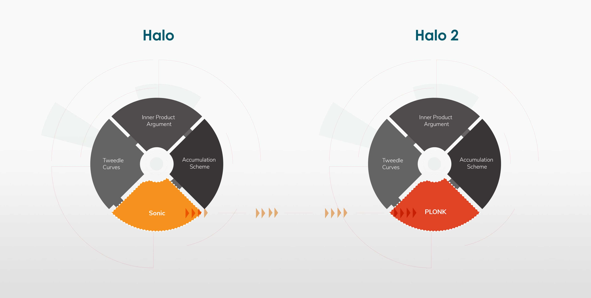

# Proof systems in the wild

Now that you have an idea about all the most basic building blocks used to create a SNARK, let’s explore some popular proof systems. A proof system is how a proof becomes real. Each system uses different methods for creating circuits and comes with different advantages and trade-offs. As an analogy, if a proof is a car, then the proof system is the design of the car factory.

## A Bird’s Eye View of PLONK

We did all that work to explore the mathematical components behind PLONK and other proof systems, so let’s fit them together to see how they interact.

<figure><figcaption>
A bird's eye view of PLONK.
</figcaption></figure>

The starting point of any proof system is the same: "What computation do we need to know has been done correctly?" Once we have that we can turn it into an idealized circuit. This part of the process is the same regardless of the proof system, but from here onwards it will vary.

In PLONK we use plonkish arithmetization to turn the idealized circuit into a detailed zk-circuit. So we now have addition and multiplication gates connected by wires to represent our computation - some of the wire values are decided, but some will have to be inserted by the prover.

So the prover now fills in all the empty wire values using their private data. With that done, we have a filled out circuit. As we mentioned in the intro, we then list all the left input wires from the gates (that would be all the values where a is in the image below, i.e. the left input wires), and get something like $$(\text{value}_1, \text{value}_2, …, \text{value}_n)$$. We represent this list as a Polynomial by simply using them as coefficients, getting out $$(f(x)=\text{value}_1 + \text{value}_2 _ x + \text{value}_3 _ x^2 + \cdots + \text{value}_n \* x^{n-1})$$.

<figure><figcaption>
An example multiplication gate.
</figcaption></figure>

We can do that for the right input wires too, as well as the output wires. And then we can commit to the polynomials using our PCS. And now we can make proofs about our computation by opening commitments (called querying in the image above since we query polynomials to get their openings). And this will keep all our data secret thanks to the DLOG assumption.

Lastly we will use the openings to our commitments inside something called an Elliptic Curve Pairing (that we didn't have time to go over, but is an important component of PLONK and other other systems) to check that they satisfy the expected relationship. And if they satisfy the expected relationship, then by the Schwartz-Zippel Lemma, we can conclude that the computation was indeed valid.

## Constraint Count

Before diving into the systems, we briefly need to explore one concept that is going to help us understand the idea of efficiency as it relates to circuits. This is the concept of a constraint count.

The constraint count determines how big the circuits are. The bigger the circuit, the longer it will take to generate the proof and the more data is required to store the proof. Lower constraint counts mean smaller circuits and faster proving (or proof generation) times, as well as less data needed to store the proof.

<figure><figcaption>
Table from the <a href="https://eprint.iacr.org/2019/953.pdf">PLONK paper</a>.
</figcaption></figure>

During the arithmetization process, the idealized circuit had to be turned into addition and multiplication gates. Each gate adds 1 to the constraint count. Generally speaking, a low constraint count is good and a high constraint count is bad. Most circuit developers are aiming for a minimal constraint count. An optimal circuit should contain enough constraints to verify a computation in a secure and valid way, but not so many that proving time, storage, and computational requirements become too burdensome.

<figure><figcaption>
Idealized circuit example from our <a href="../part-1/zksnarks-in-action.md#idealized-circuits">idealized circuits</a>.
</figcaption></figure>

Remember that circuits are reusable. Both the prover and verifier will know the layout and logic of the circuit in advance. This circuit will contain many wires with known values and some wires with undecided values. The prover will be putting private information into those undecided wires, for example inserting their private key, their address, or who they are voting for. In the backend, the prover will take the circuit, fill in their private values and make a proof; then the verifier will take in this original circuit and check whether the proof behaves as it is supposed to. Because circuits may be reused millions or even billions of times, the right constraint count is very important.

The constraint count will also vary depending on the type of arithmetization you use. For example, to represent the computation of voting, we can use Plonkish arithmetization or binary arithmetization (what computers do), which would result in different constraint counts. And there are types of problems that are more suited to using Plonkish arithmetization, and types of problems that are more suited to other methods. Comparing Proof Systems

## Comparing Proof Systems

| Proof System | Arithmetization                             | Advantages                                             | Notable Core Components                                       |
| ------------ | ------------------------------------------- | ------------------------------------------------------ | ------------------------------------------------------------- |
| Groth16      | Rank-1 Constraint System (R1CS)             | Time-tested, efficient, lots of tooling                | Elliptic Curve Pairings, Quadratic Arithmetic Programs (QAPs) |
| PLONK        | Plonkish                                    | Universal trusted setup, lots of tooling, customizable | Elliptic Curve Pairings, Polynomial Commitment Schemes (PCSs) |
| Halo2        | Plonkish                                    | Recursion, benefits of PLONK                           | Cycles of Elliptic Curves, Inner Product Argument             |
| zkSTARKs     | Algebraic Intermediate Representation (AIR) | No trusted setup, quantum-resistant                    | Hash Functions, Merkle Tries                                  |

## Groth16

The best way to start comparing ZK proof systems is to start with the first major one. Groth16 was put together in 2016 by Jens Groth and was one of the first systems to make ZK proofs feasible. Groth16 generates small proofs that are of constant size so regardless of the complexity of the statements and circuits, the proof remains succinct. It is one of the most efficient ways to make proofs about computations and is still a very good option for creating small proofs with quick verifier times.

But Groth16 has a big drawback – you have to do additional setup work for every single circuit you make. For example, once you make your [transaction circuit](../part-1/zksnarks-in-action.md#idealized-circuits), you have to do the setup ceremony. Once you have done that setup, you can use this circuit as many times as you want. But then when you need another circuit, for example a [voting circuit](../part-1/zksnarks-in-action.md#idealized-circuits), you will need to do another trusted setup ceremony.

Groth16 is great for scenarios where efficiency is paramount, but not so great when you will have a large variety of circuits or computation types that you want to make proofs about.

Yet because Groth16 has been around for a relatively long time in ZK terms, a wide and robust ecosystem of tools has developed around it – most notably, the circom compiler and language system. As a result, many developers are familiar with Groth16 because they use circom to write circuits or the many other resources available supporting Groth16. So even though it’s not the most advanced proof system, it is highly reliable, practical, and widespread. The value of Groth16 has found its way into many places in the ZK industry and will likely remain of value for a while to come.

## PLONK

PLONK is one of the most popular zkSNARKs used in the field today. After being published in [2019](https://eprint.iacr.org/2019/953.pdf), it was quickly adopted by many, and there have been many iterations on this original work.

The first component that makes PLONK stand out is the way in which it arithmetizes circuits. PLONK uses addition and multiplication gates, which is the main way we’ve been discussing arithmetization in this course. In fact, since PLONK was the first popular system to use that method, it is referred to as 'Plonkish arithmetization' or simply ‘Plonkish’. But there are other ways to arithmetize things.

Groth16 uses R1CS (Rank-1 Constraint System). Instead of addition and multiplication gates, R1CS gates have one sum multiplied by another. For example,

$$\left(a * x_1 + b * x_4\right) * \left(b * x_2 + c * x_3 + x_4\right)$$

Each sum can be as long as desired, so we often say that addition is “free” in R1CS because we don't have to add another gate for it. And if we multiply this sum out, the new sum will include a term that has $$x_4$$ squared. This is why it is called “ Rank 1” – we can't get higher powers than a square.

The use of addition and multiplication gates in Plonkish is also considered a more intuitive way to create circuits compared to R1CS.

Polynomial Commitment Schemes (PCS) are an important component of the PLONK proof system. With PCS, values or multiple messages can be committed or binded as a polynomial without revealing it (the values or messages). The purpose of this is to ensure that the polynomial we committed to could not be changed (preventing cheating). PLONK uses a PCS called [KZG](https://iacr.org/archive/asiacrypt2010/6477178/6477178.pdf) (named after its inventors, Kate, Zaverucha & Goldberg) to do this very efficiently because the commitment and opening of the polynomials remain a constant size regardless of the complexity of the polynomial.

When we introduced polynomial commitment schemes, we said that we open a polynomial by revealing what the [polynomial](../part-2/polynomial-commitment-schemes.md) was. However you may have noticed that this is not zero knowledge. If our polynomial holds all of our secret information, then when we reveal it, we also reveal the secret information. That is not ideal.

It turns out that we can open polynomials in a different way, a way that keeps the polynomial hidden. We will evaluate the polynomial at a point requested by the verifier. Then we can directly combine this value with our commitment and check whether both evaluations came from the same polynomial using some pretty advanced algebra. So an opening proof will be made (which is just an evaluation of the polynomial at some value), and then a verifier can check whether the opening proof is valid (whether the opening proof value and the commitment came from the same polynomial).

Not only does this allow us to keep secret information secret, it also makes the scheme more efficient. This is because when we reveal the polynomial, we have to send the entire polynomial, which can require sending millions of field elements. But in this new method, we only need to send an evaluation of the polynomial, which means we only need to send 1 field element. That's quite the cost saving.

The PCS used by PLONK also allowed for a universal trusted setup. Instead of needing a new setup for every circuit, one set up could be used to generate an SRS (Structured Reference String), which is basically a long list of numbers where no one knows the values, that could be reused by many different circuits and updated over time.

## Halo2

PLONK has been an incredibly valuable proof system to the applied ZK realm, and there are many derivative works that have taken the system further. [Halo2](https://electriccoin.co/blog/explaining-halo-2/) is a variation of PLONK and is the second iteration of a proof system that was created by the Electric Coin Company (ZCash), creators of one of the first private crypto coins to exist. It is widely used and is the proof system of choice for the [zkEVM Community Edition](https://github.com/privacy-scaling-explorations/zkevm-circuits) being developed by PSE.

<figure><figcaption>
Image from ECC's <a href="https://electriccoin.co/blog/explaining-halo-2/">blog post</a> announcing Halo 2.
</figcaption></figure>

Halo2 inherits many of the advantages of PLONK such as Plonkish arithmetization but uses two sets of Elliptic Curves instead of one. This allows for verification via cycles of Elliptic Curves, which allows incredible innovation called recursion.

In proof creation we saw that what we are doing is verifying that a computation was done correctly. In recursion we will instead verify two computations – the first being the computation you wanted to prove, and the second being the proof of the previous computation. By doing this, you are not only proving what you wanted to prove, but you are adding that to a chain of proofs. And now your proof will not only confirm your computation, but also every other computation that happened in the chain before you added to it.

For example, I could tally 1000 votes in an election and create a proof that it was tallied correctly as well as the results. Then you could tally the next 1000 votes, and use Halo2 to take my proof and validate both what I did and what you did. Your proof would then confirm the tallying of 2000 votes, allowing us to do this in one proof rather than two. Of course we can keep extending this and tally for millions or billions of votes in a single proof.

If another proof system was used we would either have an absolutely huge proof computation (that would probably be unfeasibly large), or we would have many proofs that would all have to be verified. But with Halo2, an aggregate proof can be built to confirm them all. Considering blockchains are built on long chains of data, a tool that can validate a whole chain in a single instance is very powerful.

Achieving this recursive proof system is possible because Halo2 uses a cycle of curves. Elliptic curves have two fields: a prime field and a base field that are different sizes, which means they have a different number of field elements and can’t represent each other directly. Halo2 uses two elliptic curves and the curves are inverses of each other. So the four resulting fields share two sets of field elements that are the same size, which means that the base field of one curve is the size of the prime field of the other, and vice versa.

By allowing proofs of computations to be verified in the context of another, recursion becomes possible. Since we use elliptic curves to verify computations, you can directly feed the verification of one proof from one curve into the other.

Let’s look at a cycle of elliptic curves.

<figure><figcaption>
This elliptic curve over the field with 11 elements has 7 elements in its group, and the curve's equation is y^2=x^3+6x+7.
</figcaption></figure>

<figure><figcaption>
This elliptic curve over the field with 7 elements has 11 elements in its group, and the curve's equation is y^2=x^3+x+1.
</figcaption></figure>

The above elliptic curves over finite fields look very similar to the [previous gif](../part-2/elliptic-curves-and-dlog.md#elliptic-curves-over-finite-fields) you saw when we explored that topic. In this case, we can see that our first curve is over $$F_{11}$$ and happens to have 7 points in the curve. The second curve is over $$F_7$$ and happens to have 11 points in the curve. This is a cycle!

If we want to make a proof using the first curve, all the numbers or data we work with must be represented as numbers between 1 and 7 (or 0 and 6) since we only have 7 points on the curve to work with. When we make that proof, the result will be a point on the curve, for example maybe the point $$(10,0)$$. Now the values in the coordinates are between 0 and 10 - i.e. they are in $$F_{11}$$.

So now we can take the proof point and use it as a number or value to make a proof over the second curve. Since the curve point’s coordinates are in $$F_{11}$$, it can naturally be used in a proof system over the second curve since the second curve has 11 points to work with.

This cycle of curves is very useful. If the field sizes didn’t match then we could still do this, but it would be more expensive because we have to use a system to ensure that everything is represented correctly.

## zkSTARKs

zkSTARKs are a proof system that do not need to conduct any setup ceremony and are plausibly quantum secure. We say it is plausibly quantum secure because we haven't actually proved it yet since quantum computers are not currently available. We are just fairly sure because zkSTARKs uses hash functions that are believed to be very difficult to break or reverse even with quantum computers unlike elliptic curves, which are not quantum secure.

STARKs use hash functions to both commit to their data (in a similar way to PCSs), and to also structure their dataset via something called a [Merkle Tree](https://www.youtube.com/watch?v=3giNelTfeAk). Merkle Trees are actually prevalent across the blockchain industry because they are a good way to create fingerprints of large datasets that can be used to efficiently confirm some piece of data was part of some data set. For example, we can use a Merkle Tree to compress all transactions or accounts in Ethereum into a single number, and we can use that number to create a short proof that a transaction is part of that set of accounts or balances.

Unlike the other proof systems mentioned, zkSTARKs do not require a trusted setup. In systems like PLONK, the [DLOG hardness](../part-2/elliptic-curves-and-dlog.md#discrete-logarithm-problem-dlog) is used as a security assumption.That assumption is then used to make some EC points of unknown order (via a trusted setup) and a scheme to commit to polynomials that were binding and hiding. The resulting Polynomial Commitment Schemes (PCSs) are currently secure but if the DLOG hardness assumption is broken (which quantum computers do indeed break), then the schemes also break.

STARK security instead relies on the hardness assumption of hash functions; that hash functions are random and that randomness can't be broken by quantum computers. This is plausibly quantum secure because we do not know of any quantum algorithms that break these hash functions (not yet at least).

However, the design of the STARK proof system does come at a cost. STARK proofs are far larger than those from other proof systems. To verify a PLONK proof on-chain costs around 300,000 gas, but to verify a STARK proof costs around 5 million gas. Considering Ethereum blocks have space for around 35 million gas since the London fork, a STARK proof is quite costly.
